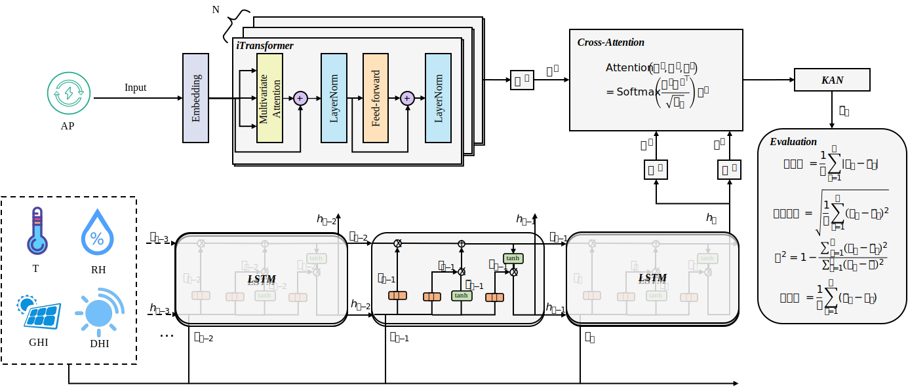
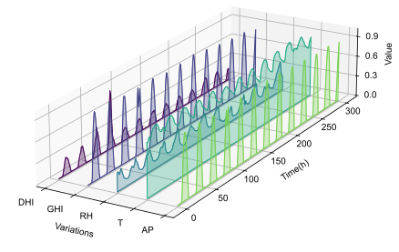
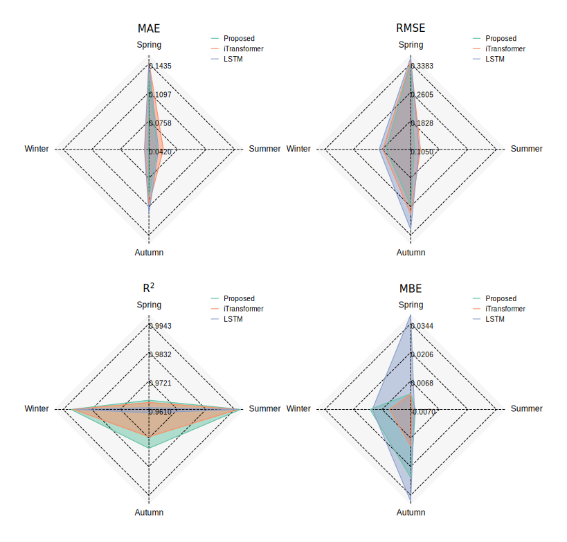

# :zap: Updated 
Replacing the cross-attention mechanism with a gating mechanism（Gated Tanh Unit，GTU） could potentially enhance the model's performance. This adjustment may lead to more effective information flow control and selective feature integration, resulting in improved outcomes.

# :memo: Abstract
Accurate photovoltaic (PV) power forecasting is critical for integrating renewable energy sources into the grid, optimizing real-time energy management, and ensuring energy reliability amidst increasing demand. However, existing models often struggle with effectively capturing the complex relationships between target variables and covariates, as well as the interactions between temporal dynamics and multivariate data, leading to suboptimal forecasting accuracy. To address these challenges, we propose a novel model architecture that leverages the iTransformer for feature extraction from target variables and employs long short-term memory (LSTM) to extract features from covariates. A cross-attention mechanism is integrated to fuse the outputs of both models, followed by a Kolmogorov–Arnold network (KAN) mapping for enhanced representation. The effectiveness of the proposed model is validated using publicly available datasets from Australia, with experiments conducted across four seasons. Results demonstrate that the proposed model effectively capture seasonal variations in PV power generation and improve forecasting accuracy.
# :rocket: Model Structure
Model Structure is shown as  
# :chart_with_upwards_trend: Date Source 
The PV power data used in this study were sourced from [the Desert Knowledge Australia Solar Centre](https://dkasolarcentre.com.au/), specifically from Site 7 in Alice Springs, Australia (latitude: -23.76, longitude: 133.87).the chosen input variables include active power (AP,kW), historical temperature (T,℃), relative humidity (RH, %), global horizontal irradiance (GHI, $Wh/m^2$), and diffuse horizontal irradiance (DHI, $Wh/m^2$), as shown in 
  

# :fire: Flowchart 
The flowchart of the proposed model is shown as 
 
# :white_check_mark: Results 
The metrics, including MAE, RMSE, $R^2$ , and MBE, are compared between iTransformer and LSTM, as presented in the table below and visualized in the accompanying radar chart.

| Seasons | Models            | MAE    | RMSE   | R2     | MBE      |
|---------|-------------------|--------|--------|--------|----------|
| Spring  | Proposed          | 0.1335 | 0.3406 | 0.9646 | 0.0006   |
|         | iTransformer      | 0.1455 | 0.3448 | 0.9637 | 0.0004   |
|         | LSTM              | 0.1448 | 0.3542 | 0.9617 | 0.0387   |
| Summer  | LSTM-iTransformer | 0.0517 | 0.1153 | 0.9966 | -0.0047  |
|         | iTransformer      | 0.0591 | 0.1316 | 0.9956 | -0.0062  |
|         | LSTM              | 0.0533 | 0.1278 | 0.9956 | -0.0052  |
| Autumn  | LSTM-iTransformer | 0.0986 | 0.2574 | 0.9761 | 0.0258   |
|         | iTransformer      | 0.1073 | 0.2805 | 0.9716 | 0.0106   |
|         | LSTM              | 0.1182 | 0.323  | 0.9623 | 0.0373   |
| Winter  | LSTM-iTransformer | 0.0428 | 0.1717 | 0.9913 | 0.0126   |
|         | iTransformer      | 0.0468 | 0.1806 | 0.9903 | 0.0032   |
|         | LSTM              | 0.0473 | 0.1907 | 0.9892 | 0.0115   |

